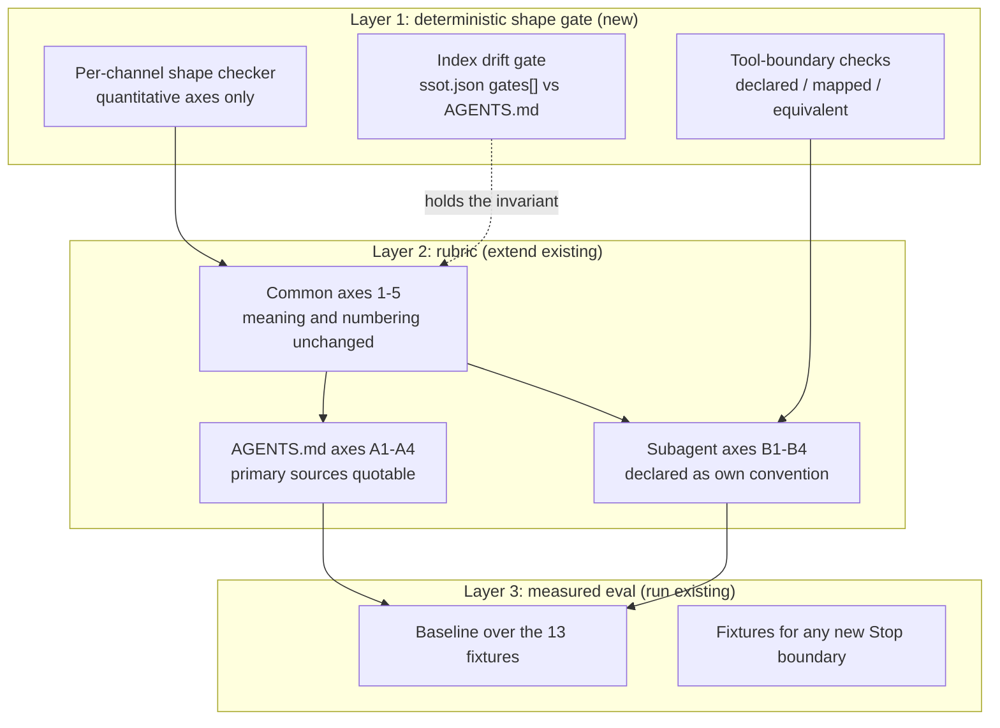

# Three-layer rigor for evaluating-context-channel-maturity

Designed 2026-09-09 to 2026-09-10 / branch `claude/claude-api-prompt-audit-33am1w`
/ baseline HEAD `daa717e` / issue #1963

## 1. Motivation

A `/claude-api prompt-audit` run on 2026-09-09 found two real defects in channels
`evaluating-context-channel-maturity` is supposed to grade.

- **Defect A**: `agents/branch-plan-task.md:3` and its siblings carry design
  archaeology in `description` (`(Decision 20, issue #1476)`, `Decision 17
  deterministic backstop for Decision 7's exclusion list`, an authoring note
  about why a list is not re-enumerated). A description rides in every request
  and is a routing contract; this content contributes nothing to a routing
  decision and duplicates the body.
- **Defect B**: `AGENTS.md` is 91 lines / 13,411 characters (about 3,352 tokens),
  and that cost is re-charged on every non-fork subagent dispatch.

The follow-up gap analysis showed both defects trace to **structure**, not to
weak wording.

- **Defect A cannot be scored by any of the five current criteria.** It is not
  ownership, not bounded growth, not placement, not enforcement-fit, not
  provenance.
- **Defect B can FAIL criterion 2 but the FAIL cannot say by how much.** It
  stops at "no bound is declared". And 91 lines is already under the documented
  200-line target, so a line-count-only threshold would PASS it.

## 2. Core Domain check

| Axis | Verdict | Basis |
|---|---|---|
| Complexity | High | The five channels differ in authority tier, load moment, and cost accounting (section 4) |
| Volatility | High | Mechanisms churn per release: `/output-style` deprecated in v2.1.73 and removed in v2.1.91, `/doctor` trim from v2.1.206, `modified` frontmatter from v2.1.214, Concise style from v2.1.237 |
| Competitive advantage | **Unknown (recorded)** | That gitapex is a distributable skills collection (`docs/motivation.md`) is a fact. This design does not judge its competitive position |

**Verdict: Core Domain**, provisional because one axis is unjudged. Rather than
an off-the-shelf answer, this design follows the **in-repository precedent**:
`evaluating-skill-quality`'s three-layer structure.

## 3. Primary sources (all fetched during the design session, agent-verified)

| # | Source |
|---|---|
| S1 | https://code.claude.com/docs/en/memory |
| S2 | https://code.claude.com/docs/en/sub-agents |
| S3 | https://platform.claude.com/docs/en/agents-and-tools/agent-skills/best-practices |
| S4 | https://claude.com/blog/the-new-rules-of-context-engineering-for-claude-5-generation-models |
| S5 | https://agents.md/ |
| S6 | https://code.claude.com/docs/en/output-styles |
| S7 | https://code.claude.com/docs/en/cli-reference |
| S8 | https://code.claude.com/docs/llms.txt (page index) |
| S9 | https://claude.com/blog/subagents-in-claude-code |
| S10 | https://opencode.ai/docs/agents/ (V1) |
| S11 | https://opencode.ai/v2/docs/agents and https://opencode.ai/v2/docs/migrate-v1/ (V2) |
| S12 | https://learn.chatgpt.com/docs/agent-configuration/subagents.md (Codex) |

### 3.1 The decisive asymmetry (S8/S3/S2/S9)

**Subagents have no dedicated best-practices page.** Checking the S8 index found
eight subagent-related pages, all reference material; `best-practices.md` is a
general Claude Code page. Skills have a dedicated page (S3).

| | Skill | Subagent |
|---|---|---|
| Dedicated best-practices page | Yes (S3) | **No** (confirmed via S8) |
| Numeric limits | name <= 64 chars / description <= 1,024 chars / body < 500 lines / references one level deep / TOC past 100 lines | Only a **combined** 15,000-token startup warning (S2). No per-file limit, no body limit |
| Description norm | What it does plus when to use it, third person required (S3) | "Be specific about the trigger conditions, not just the capability" (S9); "keep them short ... move detail into each subagent's system prompt, which only loads when that subagent runs" (S2) |
| Body norm | Progressive disclosure, degrees of freedom, avoid time-sensitive content, consistent terminology, three or more evaluations, test on three model tiers (S3) | **No published guidance** (S9 defers explicitly to the configuration reference) |
| Anti-patterns | Eight items (S3) | One only: "too many specialist agents" (S9) |

**This asymmetry is why AGENTS.md and subagent definitions declare separate
axes.** A single shared axis set would either overclaim on the subagent side
(asserting values no primary source supports) or underclaim on the AGENTS.md
side (declining to use values that are quotable).

### 3.2 Portable thresholds (values primary sources actually give)

| Target | Primary-source wording | Source |
|---|---|---|
| CLAUDE.md size | "**Size**: target under 200 lines per CLAUDE.md file. Longer files consume more context and reduce adherence." | S1 |
| CLAUDE.md ceiling | "Claude Code loads a CLAUDE.md file of up to 4 MiB in full and skips a larger file." | S1 |
| Import depth | "Imported files can recursively import other files, with a maximum depth of four hops." | S1 |
| Auto memory | "The first 200 lines of `MEMORY.md`, or the first 25KB, whichever comes first, are loaded at the start of every conversation." | S1 |
| Subagent description total | "When the combined descriptions of your subagents ... exceed 15,000 tokens, Claude Code shows a warning at startup" | S2 |

### 3.3 The authority and enforcement ladder (S1/S2/S6/S7)

This design's central finding, and what gives criterion 4 (enforcement-fit) a
measurable form.

| Channel | Relation to the system prompt | Destructiveness by default |
|---|---|---|
| `--system-prompt` / `--system-prompt-file` | **Full replacement** (S7) | Erases the default system prompt entirely |
| Output style (custom, `keep-coding-instructions` unset) | Adds, and **removes** the built-in SWE instructions (S6) | **Removal is the default** (`keep-coding-instructions` defaults to `false`) |
| Output style (`keep-coding-instructions: true`) | Adds only | None |
| `--append-system-prompt` | Appends, removes nothing (S7), but "must be passed every invocation" (S1) | None |
| Subagent definition body | That subagent's own system prompt (S2) | Does not inherit the parent's system prompt |
| CLAUDE.md / AGENTS.md | **A user message after the system prompt** (S1) | None. "no guarantee of strict compliance" (S1) |
| Auto memory | Same, first 200 lines / 25KB per session (S1) | None |

Related, and not currently modelled by criterion 1 (ownership): the authority
hierarchy managed policy > user > project > local (S1). A managed policy
CLAUDE.md "cannot be excluded by individual settings". An Output style's
`force-for-plugin` "Overrides the user's `outputStyle` setting", and on collision
Claude Code uses "the first one loaded" (S6).

### 3.4 The cost multiplier (S2)

A non-fork subagent's initial context contains "every level of the CLAUDE.md
hierarchy the main conversation loads" (the built-in Explore and Plan agents
skip it). **AGENTS.md's roughly 3,352 tokens are therefore re-charged per
dispatch.** `executing-a-branch-plan` dispatches several per wave, so the
multiplier is not one. Criterion 2 does not ask about this.

## 4. Decisions

### D1. `.claude/rules/` stays out of scope

Replace the stated reason. Instead of the current "Claude Code's own proprietary
implementation detail, not portable", state the **product reason**: gitapex is
distributed as a plugin (`docs/motivation.md`), Rules have no cross-platform
compatibility, and gitapex therefore does not use the mechanism itself.

**Consequence this design must carry**: S1 positions `.claude/rules/` as the
first remedy for CLAUDE.md growth. Since it is unavailable, criterion 2's remedy
set has to be built **from portable mechanisms only**.

- S1's `@path` import does not help: "imported files still load and enter the
  context window at launch". Not a remedy.
- Three portable mechanisms remain:
  1. Delete derivable content (S1's `/doctor` trim rule).
  2. Move procedures into skills (criterion 3 already asks this).
  3. **A subdirectory AGENTS.md** (S5: "Place another AGENTS.md inside each
     package. Agents automatically read the nearest file in the directory
     tree") -- the equivalent of a path-scoped rule, and the only such
     mechanism that holds across harnesses.

### D2. AGENTS.md and subagent definitions declare separate axes

Grounded in section 3.1. The structure is "common axes (the current five,
unchanged in meaning and number) plus channel-specific axes". Existing worked
examples and the 13 fixtures stay valid.

The axes to add, with their primary-source basis:

**AGENTS.md / CLAUDE.md axes**

| Axis | Question | Basis |
|---|---|---|
| A1 Content derivability | Does it carry content derivable from the codebase (directory listings, dependency lists, architecture overviews)? | S1's `/doctor` trim rule |
| A2 Always-loaded justification | Does it duplicate in prose a rule a deterministic gate already covers (the D4 formula)? | S1 "not enforced configuration" plus `.gitapex/ssot.json` |
| A3 Dispatch multiplier | Is its size chosen knowing it is re-charged per non-fork subagent? | S2 |
| A4 Over-specification | Does it give the current model rules where judgment would do? | S4 "Give Claude rules -> Let Claude use judgement" |

**Subagent definition axes**

| Axis | Question | Basis |
|---|---|---|
| B1 Description trigger purity | Does the description state **only when it should be called**? Everything else -- what it does, tool boundaries, design archaeology, authoring notes, body duplication -- is slop and is deleted | S2 "description: When Claude should delegate to this subagent"; S9 "Be specific about the trigger conditions, not just the capability". **This is the axis that names Defect A** |
| B2 Detail placement | Is detail in the body rather than the description? | S2 "move detail into each subagent's system prompt, which only loads when that subagent runs" |
| B3 Roster size | Are there too many specialist agents (automatic delegation grows less reliable)? | S9's single anti-pattern |
| B4 Cross-runtime tool-boundary parity | Is the declared tool boundary reproduced equivalently in **every** runtime it is distributed to? | D6 |

**B1's application rule (operator decision)**: the description states only when
it should be called. If the cohesion of when it is called is a problem, that is
not solved by lengthening the description -- **it is the moment to decide
whether upstream takes responsibility or the subagent is split**.

A1-A4 can quote primary sources directly. B1-B3 have norms in S2/S9 but **no
numbers** (section 3.1), so B-series quantitative thresholds are gitapex-owned
conventions per D5, and `criteria.md` states that plainly.

### D3. Separate the quantitative axis from the qualitative one

Defect A is not about length; it is about **content type** (archaeology in a
contract field). 717 characters sits inside a 1,024-character cap and still
carries `(Decision 20, issue #1476)`.

| Axis | Judged by | Role |
|---|---|---|
| Quantitative (characters, lines, tokens) | Shape gate (deterministic) | A **ceiling** against future growth. Not the detector for Defect A |
| Qualitative (contract vs archaeology) | Rubric (model-judged) | **This is what names Defect A** |

### D4. A three-valued ownership formula for safety rules

The correct formula is not "it matters, so put it in every turn" but "**there is
no other way to stop it, so put it in every turn**".

| Coverage | Treatment |
|---|---|
| **Full** -- the gate covers the rule's whole target range | Remove from AGENTS.md (the gate is the source of truth) |
| **Partial** -- some of it | **Keep only the uncovered remainder** |
| **None** | Keep. This is the only category that earns a place in every turn |

This is criterion 4 (enforcement-fit) inverted. Criterion 4 asks whether an
unbacked absolute prohibition is being asserted; this formula asks **why a rule
that is backed is still being carried in prose**. It is a candidate axis in its
own right and gives A2 a measurable form.

**Acceptance condition**: before removing a rule, read the target gate's scope
in both `.gitapex/ssot.json` and the gate itself. A declaration alone is not
grounds.

#### D4 applied (all 11 gates read)

| AGENTS.md rule | Covering gates | Scope confirmed by reading | Coverage | Kept in AGENTS.md |
|---|---|---|---|---|
| L21-25 untrusted text | none | -- | **None** | All |
| L62 no sending to external endpoints | none | `network-exception-set-drift` checks configuration consistency, not egress | **None** | All |
| L61 bound each tool call to scope | `routine-scope-enforcement` | A **documentation check**: "a `docs/**/specs/*routine*.md` naming a `capabilityAssumption: Broad` skill must cite a scoping mechanism". Not tool-call scope binding at all | **None** (corrected from "partial" by reading) | All |
| L60 preserve defense-in-depth | none | A design-time meta-rule | **None** | Move to a skill (the formula's third branch) |
| L59 irreversible and outward operations | `bash-cli-write-and-install-guard` / `merge-pull-request-block` / `template-overwrite-guard` / `pr-upstream-pushed` | bash install/write patterns (PreToolUse, Bash matcher only); `mcp__github__merge_pull_request` denied unconditionally; `Write` to an issue or PR template location; unpushed-commit detection on `create_pull_request` | **Partial (thin)** | Every irreversible or outward operation **outside** those four paths (force-push, deletes, sends, payments, schema migrations, key rotation, DNS changes, bulk notification, data export) |
| L63 no secrets into output sinks | `betterleaks-merge-gate` / `betterleaks-allowlist-no-removal` / `hidden-characters` / `provenance-disclosure` / `pr-body-preflight` / `post-write-provenance-recheck` | **Committed content** (per-PR full-history secret scan, hidden Unicode across git-tracked files, allowlist removal protection) and **PR or issue bodies** (draft pre-check plus post-store re-fetch and re-scan) | **Partial** | Terminal output, logs, step summaries, screenshots, error messages |
| L65 fail loudly | `except-fail-open` / `exception-handler-gap` | **Newly added** `except` clauses and decoded reads, in `.github/scripts/`, `hooks/` (plus `evals/scripts/`, `skills/*/scripts/`) Python **only** | **Partial** | Everything outside gitapex's own Python -- that is, the artifact code gitapex steers |

**Settled conclusion: no rule qualifies for "full coverage, therefore remove".**
Reading all 11 gates found none whose scope spans its rule's whole target range.

**Consequence (this changes the design's direction)**: safety rules (sections 2
and 4) barely shrink. The main lever for the line target is **moving the
procedural rules of sections 1/3/5/6 into skills**. The evidence-based answer to
"should safety rules be realized in AGENTS.md at all" is: **safety rules are the
one category that belongs there.** Eleven gate readings confirmed there is no
other way to stop them.

**Record: the premortem came true before implementation.** The initial
two-valued formula classified L65 as "gated, therefore remove". Reading the gate
declaration showed its scope is "newly added `except` clauses in two directories
of gitapex's own Python", a fraction of the rule's target range. Structurally,
gitapex is a skills collection whose users write code in other repositories, so
its gates cannot reach that work at all. That finding forced the formula from
two values to three.

### D5. Subagent thresholds (gitapex-owned; no primary-source basis)

**The only published threshold cannot ever detect Defect A.** Against S2's
combined 15,000-token warning, gitapex uses 3.6 percent (2,191 characters / 547
tokens). Any threshold is therefore a repository convention, and `SKILL.md` and
`criteria.md` say so.

| Item | Value | Kind of basis |
|---|---|---|
| description | **<= 500 characters** | In-repository evidence: `agents/review-persona.md`'s 400 characters demonstrably work for trigger routing. Plus a numeric form of S2's "shorter than a skill's, detail in the body" |
| body | **<= 500 lines and <= 5,000 tokens** | Values borrowed from the skill side; the basis is not the value but the **transplanted reason**: S3's "once Claude loads it, every token competes with conversation history and other context" holds for a subagent body too |

Effect against the current tree:

| File | desc chars | 500-char verdict | body lines | body tokens | body verdict |
|---|---|---|---|---|---|
| `agents/branch-plan-task.md` | 717 | **FAIL** | 89 | 1,398 | PASS |
| `.claude/agents/branch-plan-task.md` | 1,074 | **FAIL** | 68 | 988 | PASS |
| `agents/review-persona.md` | 400 | PASS | 132 | 1,954 | PASS |

Nothing is currently constrained on the body side; it is a ceiling for later.

**Interaction with B1 (trigger purity) -- recorded**: 500 was chosen before B1
was decided. Once a description states only when it should be called, real
lengths land well below 500 (even `review-persona.md`'s 400 characters contain
"Read-only, plugin-distributed content-reasoning subagent for ...", a statement
of **what it is**, which B1 removes). The quantitative gate therefore becomes a
**loose backstop** and B1 does the real work. Whether to tighten after the
rewrite is Open question 5 -- the number does not move without measurement.

### D6. Support both `tools` and `permission`, with equivalence held by a gate

#### D6.1 Which axis governs

`agents/*.md` is an artifact gitapex **distributes**, so the governing axis is
**Axis A (plugin-distribution target) = Claude Code plus OpenCode** (Codex is
recorded as unresolved in `docs/agent-product-scope.md`, an owner decision under
gitapex#445). Axis B's six runtimes (Codex, Gemini CLI, Devin, OpenClaw,
HermesAgent) are targets for a future enforcement adapter, and that document's
**non-conflation rule** explicitly forbids merging the two.

#### D6.2 Runtime frontmatter compatibility table (Axis A)

| Item | Claude Code | OpenCode V1 | OpenCode V2 |
|---|---|---|---|
| Definition file location | `.claude/agents/`, `~/.claude/agents/`, a plugin's `agents/` | `.opencode/agents/`, `~/.config/opencode/agents/`, the `agent` key in `opencode.json` | `.opencode/agents/`, `~/.config/opencode/agents/`, the `agents` field in configuration |
| Where the agent name comes from | frontmatter `name` (**required**, need not match the filename) | **the filename** (no `name` field) | the filename |
| `description` | **Required** | **Required** | Optional ("Strongly recommended for subagents") |
| Role of the body | That subagent's system prompt | Same | Same (a `system` field also works) |
| Tool boundary expression | `tools` (optional, inherited when omitted) / `disallowedTools` | `tools` is **deprecated**, `permission` (allow/ask/deny) recommended | `tools` **does not exist**. Only `permissions` (an ordered array) |
| Subagent designation | The file's existence | `mode: primary\|subagent\|all` (default `all`) | Same |
| Readability of the effective tool set | **Lossy** -- two hidden filters narrow the declaration (a fixed removal, plus a further reduction for background-mode subagents), so the same `tools:` resolves differently in foreground and background | Not investigated | Not investigated |

Sources: Claude Code from S2 plus `.gitapex/runtime-compatibility-matrix.json`'s
`pluginSubagentLimitations` (classification `Lossy`) and `toolSemantics`
(classification `Conservative`). OpenCode V1 from S10, V2 from S11.

**Version relationship (decisive)**: V1 and V2 coexist (V1 runs as `opencode`,
V2 as `opencode2`). There is no deprecation announcement. **V2 auto-translates
V1 agent frontmatter** -- "V2 translates legacy agent frontmatter automatically,
so these edits are optional." A V1-shaped `permission:` therefore works on V2.

#### D6.2b Codex (Axis A unresolved -- reference data)

Whether to include Codex is left unresolved by `docs/agent-product-scope.md` and
belongs to the gitapex#445 owner decision. The specification was surveyed (S12)
so that decision can be costed:

| Item | Codex |
|---|---|
| Definition file format | **TOML** (not Markdown plus frontmatter) |
| Location | `.codex/agents/` (project), `~/.codex/agents/` (personal) |
| Required fields | `name`, `description`, `developer_instructions` |
| Meaning of `description` | "Human-facing guidance for **when Codex should use this agent**" |
| Body equivalent | The `developer_instructions` **field** (not a separate file body) |
| Tool boundary expression | No `tools` field. `mcp_servers` and `skills.config`, with `sandbox_mode` for the sandbox (inherited from the parent when omitted) |
| Other optional | `model`, `model_reasoning_effort` |

**Cost if included (heavier than OpenCode support)**: a Markdown-to-TOML format
conversion, embedding the body into a `developer_instructions` string, and a
semantic conversion from `tools`/`disallowedTools` to `sandbox_mode` plus
`mcp_servers`. OpenCode support needed only frontmatter key substitution with
the Markdown intact.

**A point all three runtimes agree on (strong support for D2's B1)**:
`description` means "when to call it" in every one -- Claude Code's "When Claude
should delegate to this subagent", Codex's "Human-facing guidance for when Codex
should use this agent", OpenCode V1's "what the agent does and when to use it".
B1 matches two of the three definitions exactly and is merely stricter than the
third, so it **applies safely across all runtimes**.

#### D6.3 The decision

**Both `tools` and `permission` are supported.** What is made mandatory is
**the invariant, not a field name**:

> A tool boundary declared in `agents/*.md` **must be reproduced equivalently in
> every Axis A runtime gitapex distributes to.**

The expression is runtime-dependent, and gitapex already owns the conversion:

- The source `agents/*.md` is **Claude-canonical** (`tools:` / `disallowedTools:`).
- `hooks/gitapex_sync_opencode.py` generates copies under `.opencode/agents/`,
  dropping Claude-only keys (`name`, `tools`, `disallowedTools`) and replacing
  them with a `permission:` mapping.

#### D6.4 The asymmetry that exists today (what this design closes)

Found by reading `hooks/gitapex_sync_opencode.py`:

| Source | Declaration | Permission mapping at sync | Effective on OpenCode |
|---|---|---|---|
| `agents/review-persona.md` | `tools: Read, Grep, Glob` | `REVIEW_PERSONA_PERMISSION` (11 deny keys) | Boundary reproduced |
| `agents/branch-plan-task.md` | `disallowedTools: mcp__github` | **`None`** | **Boundary is gone** |

That script's own comment states OpenCode allows everything by default. The
`branch-plan-task` distributed to OpenCode can therefore use `mcp__github__*`;
the structural backstop that exists on Claude Code does not exist there.

`REVIEW_PERSONA_PERMISSION` is additionally a **hardcoded constant**, not derived
from the source `tools:`. Changing the source does not move the mapping (a drift
source).

#### D6.5 Gate requirements

Establishing D6.3's invariant triggers AGENTS.md section 3's "ship the drift gate
in the same change", so these three checks land **in the same change**:

1. Every `agents/*.md` declares either `tools:` or `disallowedTools:` (the
   mandatory part).
2. A permission mapping exists for every `agents/*.md` (`None` is not allowed).
3. The mapping is **equivalent** to the source declaration.

Two forms are possible for check 3; the choice is made at implementation time
(see Open question 6): derive the mapping from the source and retire the
constant (drift becomes impossible), or keep the constant and check equivalence
(the hand-written conversion keeps its freedom).

### D7. AGENTS.md keep-set

Keep **only what cannot be derived**. **Cap 50 lines, target 40** (see Open
question 1 -- relaxed from an initial 30 after D4's reading result). No character
(density) cap is set: prioritising the completeness of safety rules over the
dispatch-multiplier reduction is an operator judgment, and unbounded density is
a residual risk accepted knowingly.

S1 contains two statements in tension with each other -- "Keep it to facts
Claude should hold in every session: build commands, conventions, **project
layout**, 'always do X' rules" (section: When to add to CLAUDE.md), and
"`/doctor` ... **cuts** content Claude can derive from the codebase, such as
**directory layouts**, dependency lists, and architecture overviews, and
**keeps** pitfalls, rationale, and conventions that differ from tool defaults"
(section: My CLAUDE.md is too large).

This design reads that as (**Speculation** -- S1 does not say so explicitly): a
mechanical directory listing derivable by `ls` is on the cut side; "why it is
there / which convention governs it" is on the keep side.

The keep-set is therefore:

1. Path information only where it cannot be derived (lines that carry "why it is
   there" or "which convention governs it"; no bare directory listings).
2. Safety rules classified by D4 as "uncovered" or as the remainder of a
   "partial" -- currently confirmed to include L21-25 (untrusted text) and L62
   (external sends).
3. Conventions that differ from tool defaults, where no gate covers them.

Procedures (multi-step) move to skills. Criterion 3 already asks this, and S1
agrees: "If an entry is a multi-step procedure ... move it to a skill".

## 5. Architecture

### 5.1 Mechanism fit per layer

| Layer | Vehicle | Basis |
|---|---|---|
| Rubric | Skill (extend the existing one) | A multi-step procedure a human wants to watch and steer, reusable, general |
| Shape gate | Deterministic gate | An unconditionally reliable action and an absolute prohibition. Characters, lines, and tokens are arithmetic, not a judgment layer |
| Eval | Eval suite | The existing `evals/<skill>/` mechanism |

Note: criterion 4 asks others whether an absolute prohibition has deterministic
backing while the skill itself is prose-only. That is not a redirect case -- it
is precisely **what layer 1 resolves**.

### 5.2 Fixture cost

`.github/scripts/gitapex_gate_skill_branch_fixture_coverage.py` counts
**Stop-boundary bullets and named dispatch branches**, not criteria. The skill
currently sits at 13 of each.

- **Adding an axis costs no fixture.**
- **Each new Stop boundary costs one fixture.**

### 5.3 Index drift gate (same change)

Under D4, a removed rule leaves the gate as the source of truth. Where AGENTS.md
retains an index into gates, a gate ID change drifts that index. AGENTS.md
section 3 ("establishing an invariant ships its drift gate in the same change,
not a follow-up") therefore places this drift gate **in the same change** as the
other deliverables; it cannot be a follow-up issue.

## 6. Fit-and-Gap

| | Current | Target |
|---|---|---|
| Axes | Common five only | Common five (unchanged) plus channel-specific axes |
| Thresholds | Zero | AGENTS.md quotes primary sources; subagent values declared as own convention |
| Deterministic gate | Zero (the shape checker is `SKILL.md`-scoped; none of the 85 gates applies) | Channel shape gate, index drift gate, three tool-boundary checks |
| Measurement | Zero (13 fixtures never executed) | Baseline taken |
| AGENTS.md | 91 lines / 6 sections | 50 lines or fewer (target 40), non-derivable content only |

**Kept**: the Scope section's verbatim-import exception, the 13 Stop boundaries,
the worked examples, the Subagent dispatch section, and the meaning and
numbering of the common five criteria.

**Unbridgeable gap**: none.

## 7. Error handling and failure modes

- The shape gate fails closed (the `except-fail-open` gate enforces this for new
  `except` clauses in `hooks/*.py` and `.github/scripts/*.py`).
- An unreadable target returns `indeterminate` and stops, matching the current
  SKILL.md Precondition check 0.
- Auto memory is graded only after confirming what representation the current
  harness actually exposes (the current Precondition already requires this).
  With no such representation, the result is cannot-be-assessed.

## 8. Test strategy

1. **Quantitative axes**: unit tests for the shape gate, covering boundary values
   (499/500/501 characters) and a fail-closed path on malformed frontmatter.
2. **Qualitative axes**: the existing 13 fixtures plus one per new Stop boundary.
   Register Defect A (a description carrying archaeology) and Defect B (a bulky
   AGENTS.md) as **real fixtures** and confirm the new axes FAIL them.
3. **Baseline**: run `evals/evaluating-context-channel-maturity/` once through
   `evals/scripts/gitapex_run_eval_suite.py`. This is currently zero.

## 8.1 Implementation decomposition (does not fit one PR)

This design does not fit a single implementation plan. It is the scale AGENTS.md
section 1 calls "detailed PRD for architectural / multi-PR work", and section 5
("keep the change surface narrow") calls for decomposition. The decomposition is
settled by `planning-a-branch-from-an-issue`'s own Acceptance Criteria Map; the
boundaries this design anticipates are:

1. **Rubric layer** -- add A1-A4 and B1-B4 in `SKILL.md` and
   `references/criteria.md`, common criteria 1-5 unchanged. No Output style or
   system-prompt-append axes (Q4). Any new Stop boundary carries its fixture in
   the same change (section 5.2).
2. **Gate layer plus existing-violation fix** -- the channel shape checker, the
   index drift gate (section 5.3), D6.5's three tool-boundary checks, **and the
   fix for the existing violation D6.4 found** (adding the OpenCode permission
   mapping matching `branch-plan-task`'s `disallowedTools: mcp__github`), all in
   one change (Q8). Registered in `.gitapex/ssot.json` `gates[]`. Gate and fix
   are not split because splitting them leaves this repository red against its
   own gate from day one.
3. **AGENTS.md remediation** -- cap 50 lines, target 40 (Q1). **After 1 and 2.**
4. **Eval baseline** -- after 1, one run of
   `evals/scripts/gitapex_run_eval_suite.py`.

3 depends on 1 and 2 (the new criteria's verdict is the basis for the fix -- an
operator decision about remediation order). Codex support is not in this
decomposition (Q7 -- it goes to the gitapex#445 Axis-A expansion decision).

## 9. Open questions

1. ~~The specific character cap for AGENTS.md.~~ **Resolved** -- see D7. After
   Q2's reading result (safety rules barely shrink), relaxed to **cap 50 lines,
   target 40**. No character (density) cap. Prioritising safety-rule
   completeness over the dispatch-multiplier reduction is an operator judgment,
   and unbounded density is a **knowingly accepted residual risk**.
2. ~~The scope of the gates covering L59 / L61 / L63 / L60.~~ **Resolved** -- all
   11 gates were read and D4's application table is settled. No rule qualifies
   for "full coverage, therefore remove".
3. ~~The final count and numbering of channel-specific axes.~~ **Resolved** --
   the **channel namespace** D2 already uses (common axes stay `1`-`5`, AGENTS.md
   axes are `A1`-`A4`, subagent axes are `B1`-`B4`). Not extending the common
   numbering because: it avoids renumbering when a channel is added; the prefix
   alone says which channel an axis applies to; and it preserves D2's premise
   that the common five keep their numbers.
4. ~~Whether to create Output style and system-prompt-append axes now.~~
   **Resolved** -- **not this time.** gitapex owns no Output style, and
   system-prompt-append is used only as an eval-harness instrument
   (`evals/scripts/gitapex_run_ablation.py`). Creating an axis with no real
   instance yields a criterion no fixture can verify, reproducing the very
   zero-measurement gap (G7) this design exists to close. Both channels are
   scored with the **common five**, and an axis is added once a real instance
   exists. Section 3.3's authority ladder remains as material for common
   criterion 4.
5. **Whether to tighten the 500-character description cap after the rewrite.**
   Per D5's interaction record, real lengths after B1 should land well below 500.
   Decide from measurement.
6. **The form of D6.5's check 3 (recommendation settled, final call at
   implementation).** Reading `REVIEW_PERSONA_PERMISSION` shows the mapping is
   **not one-to-one**: OpenCode's `list` has no Claude counterpart (`Read` covers
   both), and `*mcp*` is a wildcard pattern at a different granularity from a
   concrete `mcp__github__*`. Mechanical derivation therefore looks unfaithful,
   so **keeping the constant and checking equivalence** is recommended: hold the
   mapping table as explicit data and check that the table, the source
   declaration, and the generated copy all agree.
7. ~~Whether to include Codex in Axis A.~~ **Resolved** -- **decided in a
   separate issue.** This design proceeds with Axis A = Claude Code plus
   OpenCode. D6.2b's Codex specification stays as reference data and is handed to
   the gitapex#445 Axis-A expansion decision, which has the material it needs
   there (TOML format, the `developer_instructions` field, and boundary
   expression via `sandbox_mode`/`mcp_servers` -- a heavier conversion than
   OpenCode's).
8. ~~Whether to include the OpenCode tool-boundary gap (D6.4) in this design.~~
   **Resolved** -- **included.** Add the permission mapping reproducing
   `branch-plan-task`'s `disallowedTools: mcp__github` on OpenCode, in the **same
   change** as D6.5's gate implementation, so the existing violation disappears
   the moment the gate appears (shipping the gate first would turn this
   repository red against itself on day one).

## 10. Out of scope

- `.claude/rules/` (D1).
- Grading skills themselves (`evaluating-skill-quality`'s job).
- Grading the deterministic gates' own design quality
  (`evaluating-deterministic-gate-quality`'s job). This design **builds** the
  layer 1 gates but does not grade them.
- The `.claude/settings.json` clairvoyance hook double registration (the
  prompt-audit's F2). Handled separately.
- Codex distribution support (Q7). Handed to the Axis-A expansion decision under
  `docs/agent-product-scope.md` (gitapex#445). D6.2b's survey stays as its
  material.
- A density cap (characters per line) on AGENTS.md (Q1). Only a line cap is set;
  density is deliberately left unbounded by operator judgment.

The OpenCode tool-boundary gap on `branch-plan-task` (D6.4) is **in scope**
(Q8) -- it is part of item 2 in section 8.1.

## 11. References

- The same day's audit report and gap analysis (scratch artifacts on this
  branch, uncommitted).
- `skills/evaluating-skill-quality/references/rubric.md` (the in-repository
  precedent).
- `skills/evaluating-skill-quality/scripts/shape_checks/constants.py` (the
  precedent for threshold constants).
- `.github/scripts/gitapex_gate_skill_branch_fixture_coverage.py` (the fixture
  cost rule).
- `.gitapex/ssot.json` (the 85 gate declarations).
- `.gitapex/runtime-compatibility-matrix.json` (the `pluginSubagentLimitations`
  and `toolSemantics` classifications).

## 12. Language of this document

Written in English. The design dialogue that produced it was conducted in
Japanese, and the requester's statements quoted in issue #1963 are faithful
English renderings of that dialogue; a Japanese copy of this document was kept
by the requester outside the repository.

This exposes a real contradiction in the repository's own instructions, and
closing it is part of issue #1963's scope: AGENTS.md section 6 requires
"operator-facing output (chat responses ... and plan artifacts)" to be written in
the active contributor's native language, while all 196 Markdown files under
`docs/` are in English and `post-write-provenance-recheck` enforces ASCII-only
bodies on `mcp__github__issue_write`. The intended reading -- operator-facing
communication in the contributor's language, repository artifacts in English --
is not what section 6 currently says.
