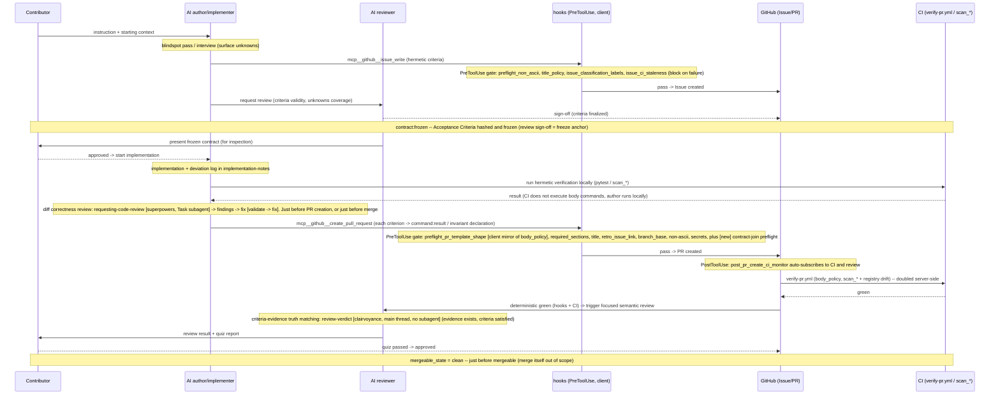
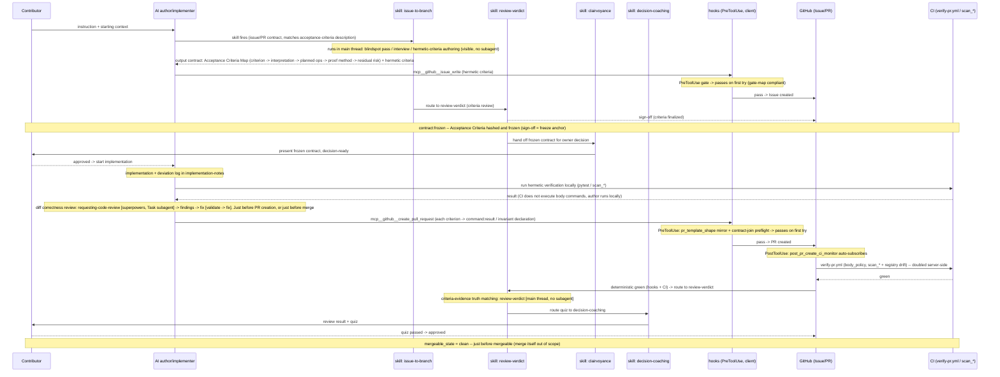

# Motivation: the Design-by-Contract issue/PR flow problem

This document preserves, as reproducible text-sourced diagrams, the two
sequence diagrams from a private analysis artifact (`dbchandoff.html`, not
published) that motivated turning gitapex into a distributable skills
collection. The diagrams are Mermaid transcriptions of the original SVGs,
translated to ASCII-only English so the source content stays reviewable
and portable in this repository.

## The problem (as-is)

Today, a contributor's instruction flows through Issue authoring, AI
review sign-off, implementation, and PR creation with no single artifact
that ties an Issue's Acceptance Criteria to a PR's evidence -- the review,
sign-off, and criteria-freeze steps are ad hoc, performed by whichever AI
happens to be in the loop at the time.

## The fix (to-be)

Once a dedicated skill lane (`issue-to-branch`, vendored from the
`clairvoyance` plugin) drives the pre-implementation steps in the main
thread -- no subagent -- and Section 6 (handoff / quiz / verdict) is
routed explicitly to the specific `clairvoyance` skill responsible for
each step, the same flow produces a machine-readable Acceptance Criteria
Map up front, and the deterministic gates (hooks, CI) pass on the first
attempt because the skill authors gate-map-compliant artifacts instead of
ad hoc ones.

Per your request, the single combined "clairvoyance" lane from the source
diagram is split here into the three actual skills it represents:
`review-verdict` (criteria review, invoked twice), `clairvoyance` (the
base handoff skill that presents the frozen contract), and
`decision-coaching` (the quiz). The source diagram expressed these
handoffs as "Route to X" labels on one shared lane; this version draws
them as explicit arrows between the named skills, without changing the
underlying flow.

## Reading

The diff between the two diagrams is exactly three changes:

1. A **skill lane** (`issue-to-branch`) now drives the pre-implementation
   steps (blindspot pass, interview, hermetic-criteria authoring) in the
   main thread -- visible and steerable, no subagent, so no understanding
   debt is added.
2. **Section 6** (handoff / quiz / verdict) is routed explicitly to the
   specific `clairvoyance` skill responsible for each step
   (`review-verdict`, `clairvoyance`, `decision-coaching`) instead of
   being reinvented ad hoc by whichever reviewer is in the loop.
3. Because the skill authors artifacts that already conform to the gate
   map, **hooks and CI pass on the first attempt** instead of triggering a
   fix loop.

The enforcement layer itself (hooks / CI / criteria-freeze) is unchanged
between as-is and to-be -- only the authoring step changes.

## Relationship to the skills in this repository

`explaining-the-work` (added alongside this document) addresses an
adjacent thread from the same design session -- routing comment, commit,
and test explanation responsibility to the right artifact -- not the
contract-join gate shown above directly.

The to-be diagram's `issue-to-branch` skill lane and the contract-join
gate + criteria-freeze CI work it depends on are a separate, larger
initiative, tracked as a 1 tracking-issue + 5 children plan. See the "Open
items carried forward" section of
[`docs/superpowers/specs/2026-07-12-skill-distribution-foundation-design.md`](superpowers/specs/2026-07-12-skill-distribution-foundation-design.md).
This document exists so that initiative's motivation is preserved in-repo
rather than living only in a private, unpublished artifact.
