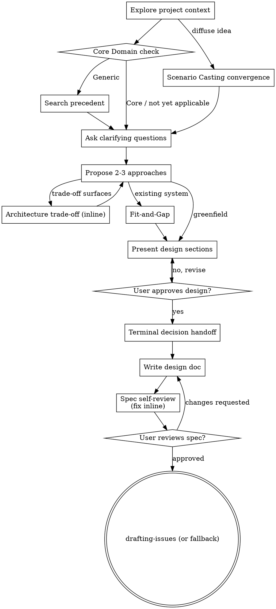

# Collaborative Modeling: Turning Ideas Into Designs

Help turn ideas into fully formed designs and specs through collaborative dialogue, informed by Domain-Driven Design elicitation and convergence techniques.

Start by understanding the current project context, then converge on a design through iterative dialogue: narrow a diffuse idea before drilling in, check whether the target is worth custom modeling at all, ask one question at a time, and surface trade-offs the moment they appear rather than deferring them to the end. Once you understand what you're building, present the design and get user approval.

<HARD-GATE>
Do NOT invoke any implementation skill, write any code, scaffold any project, or take any implementation action until you have presented a design and the user has approved it. This applies to EVERY project regardless of perceived simplicity.
</HARD-GATE>

## Anti-Pattern: "This Is Too Simple To Need A Design"

Every project goes through this process. A todo list, a single-function utility, a config change - all of them. "Simple" projects are where unexamined assumptions cause the most wasted work. Scale the design to stakes, not to a subjective sense of size: reversible, low-risk, one clear call -> a compact design (a few sentences, single round) is enough. Irreversible, high-risk, contested, or detail requested -> a full design (multi-section, multi-round) is required. Every project still gets a design and needs approval - this only sets its thickness.

## Anti-Pattern: Skipping the Core Domain Check Silently

Before committing heavy custom-modeling effort anywhere in the design, name whether you ran the Core Domain check (Checklist item 2). If you skip it, state why - never omit it silently. An unexamined "this is obviously worth building custom" is exactly the assumption knowledge crunching exists to interrogate.

## Checklist

You MUST create a task for each of these items and complete them in order:

1. **Explore project context** - check files, docs, recent commits
2. **Core Domain check** - only when about to commit heavy custom-modeling effort anywhere in the design: judge competitive advantage, complexity, and volatility. If the target is Generic, search for a precedent - a published model, an analysis pattern, or an off-the-shelf solution - before designing from scratch. See Core Domain Check below.
3. **Converge a diffuse idea via Scenario Casting** - only when the idea is unscoped across many stakeholders: gather scenario fragments, prioritize, and combine the top-priority causally-linked ones into a single Orientation Scenario before narrowing further. See Scenario Casting below.
4. **Offer the visual companion just-in-time** - NOT upfront. The first time a question would genuinely be clearer shown than described, offer it then (its own message); on approval its browser tab opens for you. If no visual question ever arises, never offer it. See the Visual Companion section below.
5. **Ask clarifying questions** - one at a time, understand purpose/constraints/success criteria. Prefer the `AskUserQuestion` tool; if unavailable, use portable question handoff (print `AskUserQuestion:` followed by the same question and choices as plain text). Apply Domain Storytelling's facilitation patterns - see below.
6. **Propose 2-3 approaches** - with trade-offs and your recommendation. Any system-level architecture trade-off surfaced here, or at any later point, gets agreed inline via the Architecture Trade-Off step below - not deferred to the end.
7. **Fit-and-Gap** - only when the idea is a change to an existing system, not a greenfield build, once a candidate approach exists: make the user's current state and target state visible side by side, then surface the gap. See Fit-and-Gap below.
8. **Present design** - in sections scaled to their complexity, get user approval after each section
9. **Terminal decision handoff** - once every section is stable, close once via the decision-handoff shape below - not repeated per section. See Terminal Decision Handoff below.
10. **Write design doc** - save to the calling repository's own `docs/superpowers/specs/YYYY-MM-DD-<topic>-design.md` convention and commit
11. **Spec self-review** - quick inline check for placeholders, contradictions, ambiguity, scope (see below)
12. **User reviews written spec** - ask user to review the spec file before proceeding
13. **Transition to issue formalization** - invoke `drafting-issues` if available in this repository; otherwise fall back to `drafting-an-acm-issue`

## Process Flow

**The terminal state is issue formalization.** Do NOT invoke `writing-plans`, `frontend-design`, `mcp-builder`, or any other implementation skill directly from here. The only handoff after this skill is `drafting-issues` (or its fallback, `drafting-an-acm-issue`) - detailed plan authoring now happens downstream of that, once an issue exists.

## The Process

**Understanding the idea:**

- Check out the current project state first (files, docs, recent commits)
- Before asking detailed questions, assess scope: if the request describes multiple independent subsystems (e.g., "build a platform with chat, file storage, billing, and analytics"), flag this immediately. Don't spend questions refining details of a project that needs to be decomposed first.
- If the project is too large for a single spec, help the user decompose into sub-projects: what are the independent pieces, how do they relate, what order should they be built? Then converge the first sub-project through the normal design flow. Each sub-project gets its own spec, issue, plan, and implementation cycle.
- For appropriately-scoped projects, ask questions one at a time to refine the idea
- Prefer multiple choice questions when possible, but open-ended is fine too
- Only one question per message - if a topic needs more exploration, break it into multiple questions
- Focus on understanding: purpose, constraints, success criteria

**Core Domain Check:**

Before committing heavy custom-modeling effort anywhere in the design, judge the target against three axes (Domain-Driven Design's Core Domain / Generic Subdomain distinction):

- **Competitive advantage** - does this differentiate the user from competitors, or is it a solved problem everyone handles the same way?
- **Complexity** - is it inherently hard, not merely tedious? A part that is simple to build can only provide a short-lived advantage.
- **Volatility** - does it change often as the business keeps its edge, or is it stable once built?

High on all three: this is Core Domain - invest custom modeling and dialogue depth here. Low, especially on competitive advantage: this is Generic Subdomain - actively search for a precedent (a published model, an analysis pattern, or an off-the-shelf solution) before designing from scratch. Don't run this check reflexively on every small decision; run it when the dialogue is about to commit real modeling effort, and name it when you skip it (see the Anti-Pattern above).

**Scenario Casting (opening convergence):**

Use only when the idea is diffuse or unscoped across many stakeholders - not for an already-focused request. Three moves, in order:

1. Gather scenario fragments in plain business language (what could happen, described concretely, not abstractly) into a backlog.
2. Prioritize the backlog.
3. Combine the top-priority, causally-linked fragments into a single Orientation Scenario - one concrete story to narrow the rest of the dialogue around.

This is a triage step, not a modeling-depth step: it exists to turn "many people, many divergent ideas about what to even discuss" into one focused starting point before the normal question-and-answer dialogue begins.

**Asking clarifying questions:**

- One question at a time, prefer the `AskUserQuestion` tool with 1-3 concrete choices. If unavailable, use portable question handoff: print `AskUserQuestion:` followed by the same question and choices as plain text.
- Apply Domain Storytelling's facilitation patterns:
  - Elicit by repeated, generic questions rather than a fixed questionnaire - "What happens next?", "How do you do that?" - to advance the model turn by turn from an underspecified idea.
  - Anti-imposition rule: use the language the user actually uses, not your own vocabulary for their domain.
  - Convergence by scoping: model the default case - the "80% case", the happy path - first. Treat variations as a quick annotation or a deliberately separate follow-up, not something to capture in the same pass.

**Exploring approaches:**

- Propose 2-3 different approaches with trade-offs
- Present options conversationally with your recommendation and reasoning
- Lead with your recommended option and explain why
- This is the one-time, whole-project direction choice - distinct from an in-dialogue Architecture Trade-Off (below), which can surface at any point and is agreed on its own, immediately

**Architecture Trade-Off (inline, wherever it surfaces):**

When the dialogue surfaces a system-level architecture trade-off - implementation options, ownership boundaries, dependency shapes, data-flow choices, or failure-mode trade-offs - agree it explicitly with the user at the point it surfaces, not deferred to the end. Release or rollout strategy (big-bang cutover vs. phased/incremental delivery, feature-flagged rollout, dark launch, and so on) is itself an instance of this: elicit it as a genuine open choice. This repository's own CLAUDE.md convention of narrow, incremental commits governs how work lands in this repository's own contribution workflow; it does not constrain the release strategy of whatever target system this dialogue is designing, which may live in a different repository entirely.

If `clairvoyance:architecture-tradeoff` is available in this repository, invoke it inline for that one decision - hand it the surfaced options as System Context. Otherwise render the same shape inline: Verdict -> Options -> Future Story -> Premortem -> Next Move.

**Fit-and-Gap:**

Use only when the idea under discussion is a change to an existing system, not a greenfield build - once a candidate approach exists from the approaches step. Make the user's current state (from the project-context exploration) and target/destination state visible side by side, then surface the gap explicitly: what has to move, what can stay, what's genuinely new. This is conversational elicitation, not a formal architecture audit.

**Presenting the design:**

- Once you believe you understand what you're building, present the design
- Scale each section to its complexity: a few sentences if straightforward, up to 200-300 words if nuanced
- Ask after each section whether it looks right so far
- Cover: architecture, components, data flow, error handling, testing
- Be ready to go back and clarify if something doesn't make sense

**Terminal Decision Handoff:**

Once every design section is iterated and stable, close once - not after every section. If `clairvoyance:clairvoyance` is available in this repository, invoke it - hand it the assembled design as Evidence and the considered approaches (from the approaches step) as Options. Otherwise render the same shape inline: Verdict -> Evidence -> Options -> Risks -> Reversibility -> Next Move.

Whichever path is used, close with an explicit consensus check: retell the assembled design from the beginning, then ask directly - "Did we miss something? Is something obviously wrong? Do you agree?" This is the same moment a Domain Storytelling workshop's closing ritual protects: the design isn't done until it has been handed back and explicitly confirmed, not merely presented.

**Design for isolation and clarity:**

- Break the system into smaller units that each have one clear purpose, communicate through well-defined interfaces, and can be understood and tested independently
- For each unit, you should be able to answer: what does it do, how do you use it, and what does it depend on?
- Can someone understand what a unit does without reading its internals? Can you change the internals without breaking consumers? If not, the boundaries need work.
- Smaller, well-bounded units are also easier for you to work with - you reason better about code you can hold in context at once, and your edits are more reliable when files are focused. When a file grows large, that's often a signal that it's doing too much.

**Working in existing codebases:**

- Explore the current structure before proposing changes. Follow existing patterns.
- Where existing code has problems that affect the work (e.g., a file that's grown too large, unclear boundaries, tangled responsibilities), include targeted improvements as part of the design - the way a good developer improves code they're working in.
- Don't propose unrelated refactoring. Stay focused on what serves the current goal.

## After the Design

**Documentation:**

- Write the validated design (spec) to the calling repository's own `docs/superpowers/specs/YYYY-MM-DD-<topic>-design.md` convention
  - (User preferences for spec location override this default)
- Use elements-of-style:writing-clearly-and-concisely skill if available
- Commit the design document to git

**Spec Self-Review:**
After writing the spec document, look at it with fresh eyes:

1. **Placeholder scan:** Any "TBD", "TODO", incomplete sections, or vague requirements? Fix them.
2. **Internal consistency:** Do any sections contradict each other? Does the architecture match the feature descriptions?
3. **Scope check:** Is this focused enough for a single implementation plan, or does it need decomposition?
4. **Ambiguity check:** Could any requirement be interpreted two different ways? If so, pick one and make it explicit.

Fix any issues inline. No need to re-review - just fix and move on.

**User Review Gate:**
After the spec review loop passes, ask the user to review the written spec before proceeding:

> "Spec written and committed to `<path>`. Please review it and let me know if you want to make any changes before we formalize it into an issue."

Wait for the user's response. If they request changes, make them and re-run the spec review loop. Only proceed once the user approves.

**Issue formalization handoff:**

- Invoke `drafting-issues` if it is available in this repository, to formalize the approved design into a GitHub issue with its own Acceptance Criteria Map.
- If `drafting-issues` is not yet available, fall back to `drafting-an-acm-issue`.
- Do NOT invoke `writing-plans` or any other implementation skill directly. Detailed plan authoring happens downstream of issue formalization.

## Key Principles

- **One question at a time** - Don't overwhelm with multiple questions
- **Multiple choice preferred**, via the `AskUserQuestion` tool when available - easier to answer than open-ended when possible
- **YAGNI ruthlessly** - Remove unnecessary features from all designs
- **Explore alternatives** - Always propose 2-3 approaches before settling
- **Incremental validation** - Present design, get approval before moving on
- **Be flexible** - Go back and clarify when something doesn't make sense
- **Check Core Domain before deep modeling** - don't spend custom-modeling effort on a solved problem
- **Surface architecture trade-offs where they arise** - agree them inline, not as an afterthought

## Visual Companion

A browser-based companion for showing mockups, diagrams, and visual options during the dialogue. Available as a tool - not a mode. Accepting the companion means it's available for questions that benefit from visual treatment; it does NOT mean every question goes through the browser.

**Offering the companion (just-in-time):** Do NOT offer it upfront. Wait until a question would genuinely be clearer shown than told - a real mockup / layout / diagram question, not merely a UI *topic*. The first time that happens, offer it then, as its own message:
> "This next part might be easier if I show you - I can put together mockups, diagrams, and comparisons in a browser tab as we go. It's still new and can be token-intensive. Want me to? I'll open it for you."

**This offer MUST be its own message.** Only the offer - no clarifying question, summary, or other content. Wait for the user's response. If they accept, start the server with `--open` so their browser opens to the first screen automatically. If they decline, continue text-only and don't offer again unless they raise it.

**Per-question decision:** Even after the user accepts, decide FOR EACH QUESTION whether to use the browser or the terminal. The test: **would the user understand this better by seeing it than reading it?**

- **Use the browser** for content that IS visual - mockups, wireframes, layout comparisons, architecture diagrams, side-by-side visual designs
- **Use the terminal** for content that is text - requirements questions, conceptual choices, tradeoff lists, A/B/C/D text options, scope decisions

A question about a UI topic is not automatically a visual question. "What does personality mean in this context?" is a conceptual question - use the terminal. "Which wizard layout works better?" is a visual question - use the browser.

If they agree to the companion, read the detailed guide before proceeding:
`skills/collaborative-modeling/visual-companion.md`
